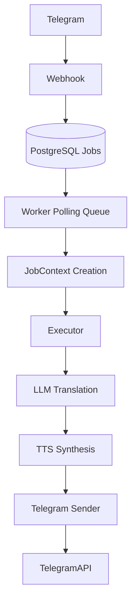

# Telegram Bot Webhook Starter (Dotnet)

A production-oriented skeleton for Telegram bots built with:

- .NET 10
- ASP.NET Core Minimal API
- PostgreSQL + EF Core
- OpenAI (LLM + TTS)
- OpenTelemetry metrics + OTLP exporter
- Serilog + Loki logging
- Docker + Fly.io

## Overview

This service receives Telegram updates via webhook, persists them as jobs in PostgreSQL, and processes them asynchronously in background workers.

The webhook stays lightweight and returns quickly. Long-running work (LLM translation, TTS generation, Telegram delivery) runs in worker execution flow.
The design prioritizes minimal webhook latency and durable background job execution.

## Architecture

Runtime architecture:



Queue model:

- The system uses a PostgreSQL-backed polling queue (`Jobs` table).
- There are no in-memory queues.
- There are no message brokers.
- Multiple app instances coordinate via atomic database updates.
- Execution parameters are persisted per job via `ExecutionOptions`.
- Horizontal scaling is supported by running multiple application instances.

## Job Processing Model

`Jobs` schema rules:

- `Id` is `BIGINT GENERATED BY DEFAULT AS IDENTITY` and maps to `.NET long`
- `UpdateId` is `BIGINT NOT NULL` with a unique index for webhook idempotency
- `UpdatePayload` is `TEXT` (raw JSON), not `json/jsonb`
- `ExecutionOptions` is `jsonb NOT NULL DEFAULT '{}'::jsonb`
- `Status` is stored as `INT` and backed by `JobStatus`:
  - `Pending = 0`
  - `Processing = 1`
  - `Completed = 2`
  - `Failed = 3`
- Polling index: `IX_Jobs_Status_Attempts_Id`

Webhook idempotency:

1. Webhook receives `Update`.
2. It attempts to insert a `Job` using `UpdateId`.
3. If insert succeeds, returns HTTP 200.
4. If unique constraint violation occurs, treats update as duplicate and returns HTTP 200.

Worker semantics:

1. Webhook stores jobs as `Pending`.
2. Worker polls with jittered delay.
3. Candidate selection uses `Status = Pending`, `Attempts < MaxAttempts`, `ORDER BY Id ASC` (FIFO).
4. Acquisition is atomic: `Pending -> Processing`, `Attempts++`, `UpdatedAt = now`.
5. If acquired job age exceeds `MaxJobAgeMinutes`, mark as `Failed` without executing pipeline.
6. On success, mark `Completed`.
7. On failure:
   - `Attempts < MaxAttempts` -> back to `Pending`
   - `Attempts >= MaxAttempts` -> `Failed`

Concurrency and safety:

- Each process can run up to `MaxConcurrentJobs` in parallel.
- Each job execution uses its own DI scope and `DbContext`.
- Multi-instance safety relies on atomic update acquisition.
- Automatic recovery of stuck `Processing` jobs is not implemented in this starter template.
- Manual intervention may be required if a worker crashes during execution.

### ExecutionOptions (JSONB)

`ExecutionOptions` are persisted with each Job and represent execution parameters only.

- They are stored in PostgreSQL as `jsonb`.
- They are created at webhook time and treated as immutable during processing.
- Worker and executor consume them as part of the job execution snapshot.

Example:

```json
{
  "targetLanguage": "de"
}
```

Supported option:

- `targetLanguage`

### Target Language Propagation

- Webhook reads `update.Message.From.LanguageCode`.
- If present, webhook stores it as `ExecutionOptions["targetLanguage"]`.
- Executor reads `targetLanguage` from `ExecutionOptions`.
- If the option is missing, executor applies fallback language `"en"`.

### LLM Behavior

- Translation language is not hardcoded.
- Prompt generation is parameterized by runtime language:

```text
Translate the following text to {targetLanguage}.
```

### TTS Behavior

- TTS voice/model configuration remains static in the starter.
- TTS receives text already translated by the LLM stage.
- Voice-language matching is out of scope for this starter project.

## External Integrations

- Telegram Bot API (via Telegram.Bot SDK)
  - Incoming updates via webhook
  - Outgoing typing/audio delivery via `Telegram.Bot`
- OpenAI API
  - LLM translation endpoint
  - TTS synthesis endpoint
- PostgreSQL
  - Durable job queue and worker coordination store
- OpenTelemetry OTLP exporter
  - Metrics export to OTLP endpoint
- Loki
  - Structured log export via Serilog sink

## Observability

### Metrics

OpenTelemetry metrics are emitted from webhook, worker, LLM, TTS, and Telegram sender components.
Metric names follow Prometheus-style naming conventions.

Implemented metrics:

- Counters:
  - `jobs_created_total`
  - `jobs_acquired_total`
  - `jobs_completed_total`
  - `jobs_failed_total`
  - `llm_requests_total`
  - `llm_errors_total`
  - `tts_requests_total`
  - `tts_errors_total`
  - `telegram_send_total`
  - `telegram_send_errors_total`
- Histograms:
  - `job_duration_seconds`
  - `job_queue_wait_seconds`
  - `llm_latency_seconds`
  - `tts_latency_seconds`
  - `telegram_send_latency_seconds`
- Gauges:
  - `jobs_pending`
  - `jobs_processing`
  - `worker_inflight_jobs`

### Logs

Structured event names:

- `job_created`
- `job_acquired`
- `job_completed`
- `job_failed`
- `llm_started`
- `llm_completed`
- `llm_failed`
- `tts_started`
- `tts_completed`
- `tts_failed`
- `telegram_send_started`
- `telegram_send_completed`
- `telegram_send_failed`

Correlation fields are propagated through worker -> executor -> services using job context (`job_id`, `update_id`, `chat_id`, `attempt`).
LLM operation naming is generic (`translate_text`) rather than German-specific.

### Instrumentation

- Metrics are configured through OpenTelemetry Meter API and exported through OTLP.
- ASP.NET Core and HttpClient instrumentation are enabled.
- Structured logs are written to console and optionally exported to Loki when enabled.

## Configuration

Configuration uses strongly-typed Options pattern.
Configuration is loaded from:

1. `appsettings.json`
2. environment variables
3. command-line arguments

Environment variable overrides use ASP.NET Core double underscore convention:

`Section__Property=Value`

Example:

`Worker__MaxConcurrentJobs=8`

Keys used by current code:

Telegram:

- `Telegram__BotToken`
- `Telegram__WebhookSecret`

Database:

- `Database__ConnectionString`

Worker:

- `Worker__PollIntervalMs` (default `1000`)
- `Worker__MaxConcurrentJobs` (default `4`)
- `Worker__MaxAttempts` (default `2`)
- `Worker__MaxJobAgeMinutes` (default `30`)

LLM:

- `LLM__ApiKey`
- `LLM__Model` (default `gpt-4.1-mini`)
- `LLM__BaseUrl` (default `https://api.openai.com/v1/`)
- `LLM__TimeoutSeconds` (default `60`)

TTS:

- `TTS__ApiKey`
- `TTS__Model` (default `gpt-4o-mini-tts`)
- `TTS__Voice` (default `alloy`)
- `TTS__Format` (default `mp3`)
- `TTS__TimeoutSeconds` (default `30`)
- `TTS__MaxInputLength` (default `1000`)

Observability:

- `Observability__OtlpEndpoint`
- `Observability__OtlpApiKey`
- `Observability__ServiceName`

Loki:

- `Loki__Enabled`
- `Loki__Endpoint`
- `Loki__Username`
- `Loki__Password`
- `Loki__ServiceName`

Target language is derived at runtime from Telegram user metadata (`update.Message.From.LanguageCode`).

## Startup Behavior

EF Core migrations are applied automatically on startup using `db.Database.Migrate()`.

If migration fails, application startup fails.

## Development

- Run locally with `dotnet run --project src/BotTemplate.Api`.
- Docker is optional for local infrastructure (for example PostgreSQL).
- Running API in Docker during development is not required.

Optional local PostgreSQL via Docker:

```bash
docker run -d \
  --name bot-postgres \
  -e POSTGRES_USER=bot \
  -e POSTGRES_PASSWORD=bot \
  -e POSTGRES_DB=botdb \
  -p 5432:5432 \
  postgres:16
```

## Project Structure

`/src`

- `BotTemplate.Api`
  - `Endpoints` (webhook)
  - `Workers` (polling queue worker)
  - `Execution` (job executor)
  - `LLM` (OpenAI translation integration)
  - `TTS` (OpenAI TTS integration)
  - `Services` (Telegram sender)
  - `Migrations` (EF Core database migrations)
- `BotTemplate.Core`
  - `Jobs` (job entity/status)
  - `Configuration` (options)
  - `Execution` (execution abstractions/context)

`/docs/codex`

- `ITERATION_*.md` (detailed design specifications)
- `RULES.md` (repository workflow rules)

## Documentation

Detailed design specifications are available in `docs/codex/ITERATION_*.md`.
